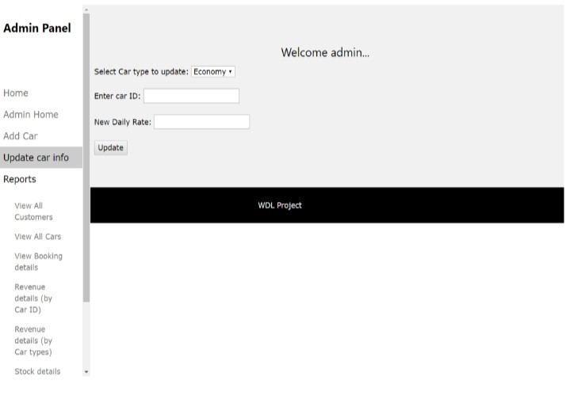

# Rentndrive

The system will be done according to the scope of Rental Car Online System (RCOS) which is
stated as below: 
System:
1. Provide car catalog for users as an alternative for them to select car if they want to choose car
by their own.
2. Allows admin to search user information from the database based on the user&#39;s ID card
number or their name.
3. Admin can add new or remove existing car listinngs and set the rates accordingly.
4. Customer can check booking details in profile after logging in.

### Screenshots

